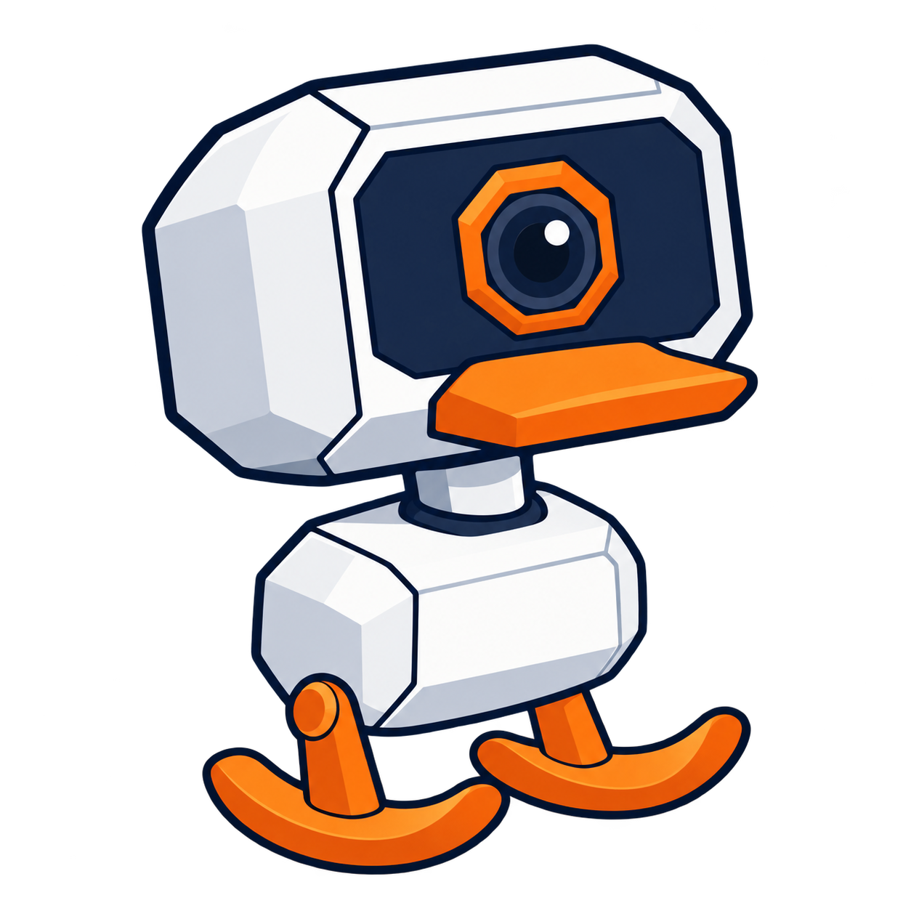
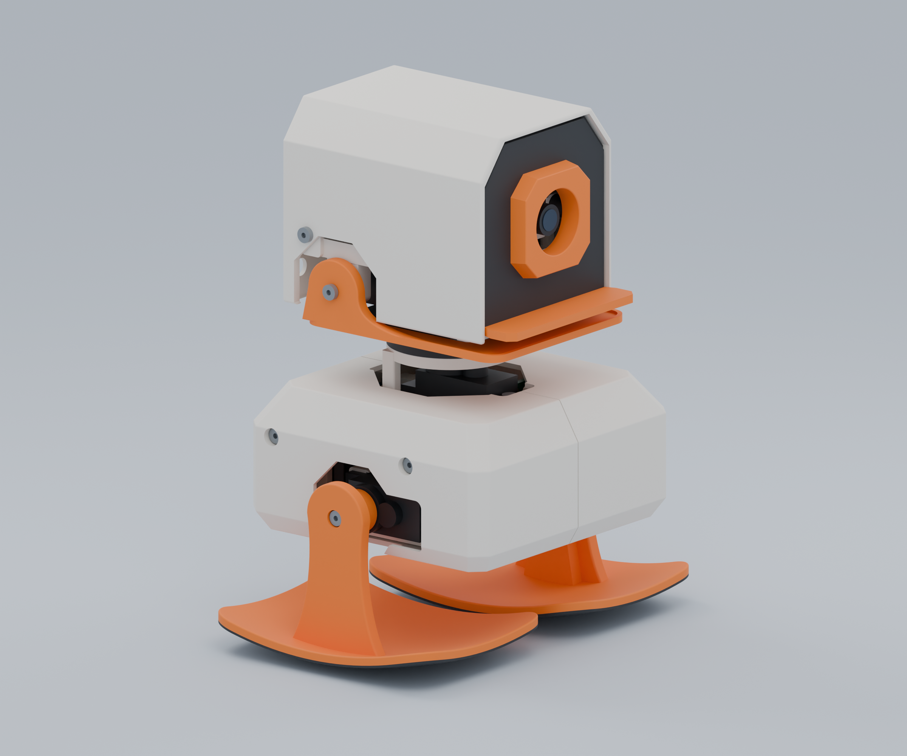
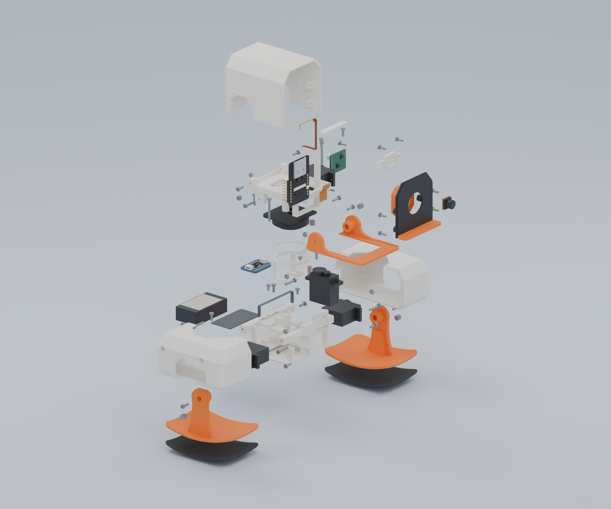

<p align="center">
  
</p>

<h1 align="center">MicroDuckling</h1>
<p align="center">A little robot to print, build, learn from and improve together.</p>
<p align="center">
  <a href="docs/licensing.md"></a>
  <a href="ROADMAP.md"></a>
  <a href="https://github.com/itchson/MicroDuckling/actions/workflows/checks.yml"></a>
</p>

MicroDuckling is an independent hobby robot project inspired by [Microduck from Pollen Robotics / Hugging Face](https://pollen-robotics.com/microduck/). The goal is a **small, affordable robot that people can build with printed parts and accessible electronics**, then make better as a community.

The design pairs a big faceted head and a small white body with smooth orange rocker feet. Four MG90S servos move the left leg, right leg, neck and mouth. The fixed upper bill is part of the face print, while the lower jaw opens. Printed-part assembly connections use M2 fasteners. Integrated sockets in the legs, neck carrier and jaw engage the servo output splines directly; their provisional profile still needs qualification against the actual servo batch. A local browser experiment runs rigid-body physics, searches gait patterns and approaches camera-visible targets. **NVIDIA Isaac Sim / Isaac Lab** and useful movements on real hardware remain development goals.

**This is an early CAD prototype, not a proven walking kit.** Contributions that uncover a fit problem, reduce cost, simplify assembly or improve the simulation are part of the project’s purpose.

<p align="center"></p>
<p align="center"><em>R07 mechanical design with separately licensed electronics visuals. The mascot is an illustration; neither image is a photograph of a working robot.</em></p>

## Where it stands

| Area | Current state |
| --- | --- |
| Mechanical design | R07: 14 robot print parts, two fit coupons, integrated spline sockets and a one-piece face/upper bill |
| Size and mass | About 136 mm tall; 249 g estimated complete mass, not measured |
| CAD checks | Printable mesh checks and sampled clearance reviews completed on the source design |
| Physical assembly | Not yet verified with printed parts and the specified hardware |
| Electronics and firmware | Four direct ESP32-CAM PWM signals and one shared 5 V regulator; I/O source and wiring supplied, hardware application/testing unfinished |
| Walking | Browser contact-model experiments; physical walking, servo temperature and traction need bench tests |
| Simulation | Physical gait search and geometric-camera approach checks tied to each asset revision; Isaac Lab scaffold remains unexecuted |
| Affordability | Proposed build with budget regulator: about A$100–110 including battery and print material; alternative mounts and power testing required |

Australian prices checked on 11 September 2026. The budget alternative uses different boards from the current CAD reference and excludes shipping, charger and tools. See [parts and costs](docs/parts-research.md), the [BOM](docs/bom.md) and the [engineering review](docs/engineering-review.md).

## Start exploring

- **Inspect the design:** open [the mechanical FreeCAD model](cad/MicroDuckling_R05_mechanical.FCStd) or [the printed-part STEP](cad/MicroDuckling_R05_printed.step).
- **Browse print files:** [STL](cad/stl/) and [3MF](cad/3mf/). Start with the clearance and spline fit coupons and the [hardware measurement checklist](docs/hardware-measurements.md); a full print is not yet qualified.
- **Understand the assembly:** read the [assembly review](docs/design-and-assembly.md) and [R07 changes](docs/r07-direct-mount-design.md).
- **Work on simulation:** start with the [simulation guide](docs/simulation.md) and [roadmap](ROADMAP.md).

The viewer includes **77 assembly records plus two fit coupons**: 75 mechanical records and two separately supplied component visuals. The four horn arms and separate upper-bill fasteners are absent from R07. The IMU adapts an Adafruit PCB under CC BY-SA 3.0; the shared regulator is an original approximation. The PCA9685 and second regulator were removed. Native mechanical CAD and printed-part STEP stay separate, while mass accounts for the complete intended robot. See [license scope](docs/licensing.md) and [direct wiring](docs/electronics.md).

### Run the CAD viewer locally

Install Node.js 22.18 or newer (Node 24 is used in CI), then:

```sh
git clone https://github.com/itchson/MicroDuckling.git
cd MicroDuckling/viewer
npm ci
npm run dev
```

Open the local address printed in the terminal, normally `http://127.0.0.1:5192`. Orbit the model, select and isolate parts, open the exploded view, inspect the inside and pose the four joints. Separate browser physics controls run a gravity/contact experiment, search bounded gait parameters and test camera control using a synthetic 96 × 72 image. Joint sliders alone are a pose preview; none of these controls command hardware. FreeCAD is not required to use the viewer. See the [simulation guide](docs/simulation.md) for test coverage and the measured simulation criteria and remaining hardware limitations.

<p align="center"></p>

### Develop the design

The [developer guide](docs/development.md) covers the CAD toolchain, optional supplier reference downloads and checks. Parametric Python source lives in [src](src/); the native public model contains editable solids. The source is the place to change design parameters and regenerate geometry.

```sh
python -m pip install -r requirements-dev.txt
python scripts/validate_repository.py
python -m unittest discover -s simulation/tests
cd viewer
npm ci
npm test
npm run build
```

## Help a little duckling grow

You do not need to solve the whole robot to contribute. A measured servo spline, a clearly photographed fit failure, a cheaper power option, a better assembly step or a reproducible simulation result can all help.

Read [CONTRIBUTING](CONTRIBUTING.md), browse the [roadmap](ROADMAP.md), or [open an issue](https://github.com/itchson/MicroDuckling/issues/new/choose). Please include what you actually tested and distinguish measured results from estimates. The [conduct](CODE_OF_CONDUCT.md) and [governance](GOVERNANCE.md) documents explain how we work together.

## License and inspiration

Original MicroDuckling source, documentation, mechanical exports and independently authored regulator visuals use [Apache-2.0](LICENSE). The Adafruit IMU adaptation and electronics-inclusive presentation renders/thumbnails use **CC BY-SA 3.0**, with credit to Limor Fried/Ladyada for Adafruit Industries and MicroDuckling contributors. Notices for the former PCA9685 adaptation remain for historical releases. Adapted shadcn UI files retain MIT notices. See [license scope](docs/licensing.md) and [third-party notices](THIRD_PARTY_NOTICES.md) before redistributing assets.

MicroDuckling is an independent fan project, with its own design and identity. It is not an official Microduck model, a scaled copy of the official CAD, or affiliated with or endorsed by Hugging Face, Pollen Robotics or NVIDIA. Their names identify inspiration and intended tooling. The original mascot was made with OpenAI image generation; its [prompt and provenance](assets/brand/PROVENANCE.md) are included.
