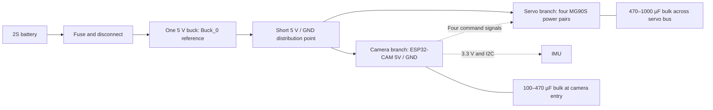

# Parts and shared-supply research

The revised build uses **one 5 V regulator feeding four MG90S servos and the ESP32-CAM**, with separate power branches and common ground. The ESP32 generates four servo command signals directly. The PCA9685 and second logic regulator are removed from the active BOM. Pin allocation and firmware constraints belong in [electronics](electronics.md).

## Cost of the simpler layout

The [BOM](bom.md) now uses the project's A$20 allowance for four servos and A$30 for an OV2640 ESP32-CAM. With an A$16.95 battery, A$16.80 regulator candidate and A$4.60 IMU, electronics total **A$88.35**; consumed hardware and print material bring that to roughly **A$100–110**, excluding shipping, charger and tools. A cheaper camera/servo selection could approach A$80, with different fit and sourcing assumptions.

Buck_0 remains the dimensioned Pololu D24V50F5 reference. Australian prices checked on **11 September 2026** were [A$37.95 at Robot Gear](https://www.robotgear.com.au/Product.aspx/Details/1003-5V-5A-Pololu-Step-Down-Voltage-Regulator-D24V50F5) and [A$49.95 at Core](https://core-electronics.com.au/pololu-5v-5a-step-down-voltage-regulator-d24v50f5.html). Using it instead of the A$16.80 candidate raises the same build allowance to **A$120.50–141.50**. The board establishes a known outline and mounting arrangement; its price is not the minimum cost of supplying the robot.

The former branded combination—Adafruit PCA9685, D24V50F5 and D24V10F5—was A$98.15 from one shop before servos or camera. Two of those boards are no longer required. The cheaper [DFRobot DFR0753](https://www.dfrobot.com/product-2162.html) is a candidate pending measured dimensions, mounting, wiring and electrical qualification; its advertised efficiency is specified at **12 V input and full load**, outside this 2S operating point.

## Voltage, current and heat

The retained battery architecture is **2S LiPo: about 7.4 V nominal, 8.4 V fully charged**. The buck converter supplies regulated 5 V to both branches; the camera board's onboard regulator supplies its internal 3.3 V electronics. Servo motor current comes directly from the 5 V distribution, not through ESP32 GPIO or camera-board power traces. The [Ai-Thinker V1.0 datasheet](https://wiki.diustou.com/cn/w/upload/b/be/Esp32-cam_product_specification_zh.pdf) specifies **4.75–5.25 V** at the ESP32-CAM supply, and lists 180 mA with its flash LED off and 310 mA with full flash brightness. These operating figures are not guaranteed transient maxima.

TowerPro's [MG90S specification](https://towerpro.com.tw/product/mg90s-3/) gives torque/speed information but **no stall-current figure**. A guaranteed four-servo peak cannot be calculated from that page. Reserve **0.5 A for camera, Wi-Fi and logic as a design allowance**, then measure the actual servo batch. These examples show the sensitivity; the per-servo currents are assumptions, not established MG90S bounds:

| Assumed simultaneous peak per servo | Four servos | Plus 0.5 A logic allowance | 5 V output power |
|---:|---:|---:|---:|
| 0.5 A | 2 A | 2.5 A | 12.5 W |
| 1.0 A | 4 A | 4.5 A | 22.5 W |
| 1.5 A | 6 A | 6.5 A | 32.5 W |

Peaks can coincide during startup, abrupt reversals or a mechanical obstruction. The upper example exceeds a nominal 5 A supply. Espressif recommends at least 500 mA capacity for the **ESP32 chip's 3.3 V supply**; this supports allowing headroom but is not measured 5 V camera-board consumption. [Espressif hardware guidelines](https://docs.espressif.com/projects/esp-hardware-design-guidelines/en/latest/esp32/schematic-checklist.html)

Pololu labels the D24V50F5's **5 A as typical and thermally limited**. Its specification lists about 6 V minimum input at light load, rising to about 6.2 V at 5 A; leave additional margin for wiring loss, battery sag and actual dropout behavior. A nearly empty 2S pack at 6 V cannot be assumed to maintain a clean 5 V rail under high load. Establish the battery stop threshold from the pack limits and loaded voltage measurements, rather than waiting for the camera to brown out. [Pololu specifications](https://www.pololu.com/product/2851/specs)

For illustration, **4.5 A at 5 V and 90% efficiency** requires about **3.38 A from 7.4 V**, rising to **3.91 A at 6.4 V**, and dissipates **2.5 W in the regulator**. These are calculated examples using `Iin = Vout × Iout / (Vin × efficiency)` and `loss = Pout × (1/efficiency − 1)`, not measured robot performance. Pololu's advertised 85–95% efficiency implies roughly 1.2–4.0 W loss at that output power. Enclosure temperature, airflow and connection resistance determine the usable sustained load. A short 5 A bench demonstration does not establish a continuous enclosed rating. [Pololu product description](https://www.pololu.com/product/2851)

## Proposed power distribution

Give the camera its own positive/return pair from the distribution point so servo return current does not flow along its ground lead. Start with **470–1000 µF, at least 10 V** bulk capacitance at the servo bus and **100–470 µF, at least 10 V** at the camera's 5 V entry. Keep the board's ceramic decoupling; 10 µF plus 0.1 µF close to a branch entry are reasonable additional starting values where absent. Check startup/inrush, stability and transient response with the chosen regulator. Adafruit suggests about 100 µF per servo as an initial bulk estimate, and Espressif specifies local 10 µF/0.1 µF decoupling for its chip rails. These references support the approach; the additional module-level values here are engineering starting points. [Adafruit servo power guide](https://learn.adafruit.com/16-channel-pwm-servo-driver/hooking-it-up), [Espressif guidelines](https://docs.espressif.com/projects/esp-hardware-design-guidelines/en/latest/esp32/schematic-checklist.html)

Use short battery leads. A roughly **100 µF, 25 V electrolytic near regulator VIN** is an input-transient starting point, especially with long leads or a switch; verify its effect on the actual circuit. Pololu demonstrates how lead inductance and low-ESR input capacitors can cause switching spikes, and how additional electrolytic capacitance can damp them. [Pololu input-transient measurements](https://www.pololu.com/docs/0J16/5)

Bulk capacitance does not replace supply current: `ΔV = I × Δt / C` means even 1000 µF loses 1 V while supplying a 1 A deficit for only 1 ms. Check 5 V at the camera header during coordinated servo starts/reversals, camera streaming and low-battery loading, and log regulator/connector temperature over sustained operation. Qualify the shared supply by those results; a regulator's current headline alone is insufficient.

## IMU and leg motion

Manual servo poses can run without an IMU. The planned balance policy consumes angular velocity and estimated gravity direction, so an IMU remains in the learning-oriented BOM. A budget MPU-6050 needs its own mount, driver and calibration; it does not provide servo joint-angle feedback. See [simulation observations](simulation.md).

Both hips rotate about model +Y. Coordinated pitch can incline the torso relative to supported feet, giving a bow-like motion; actual motion depends on rolling contact, mass distribution and balance. The current mechanical envelope remains **−12° to +12° per hip**. The servo's advertised rotation range does not establish additional clearance. [Joint derivation](../simulation/derive_manifest.py), [CAD generator](../src/build_cad.py)

Record delivered dimensions and electrical measurements in [hardware measurements](hardware-measurements.md). Alternative boards and packs remain candidates until their fit and loaded behavior are checked.
